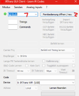
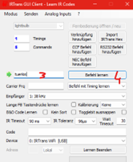
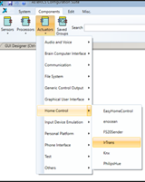
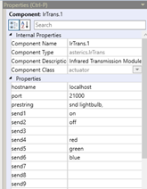
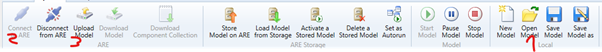

# ATLab Küchensteuerung für Gerald

## Über Gerald
Er kann den rechten Arm leicht heben bzw. senken, Handfunktion ist aber nicht vorhanden. Die große linke Zehe, Kopf, Mund/Lippen und Augen können bestätigt werden, als auch non-verbale Funktionalitäten sind vorhanden.
## Verwendete Komponenten
Licht (FABI), Jalousien (ARE, ACS, Kitchen Webseite mit openHAB verknüpft) und Glühbirne (IRTrans, ACS, ARE, AsTeRICS Grid) können gesteuert werden. Bis auf das Licht wird alles mit der CameraMouse gesteuert.
### FlipMouse
In unserem Fall wird es dieselbe Funktionalität haben wie der FABI, also anstatt von einem Teil zu haben, wo man Sachen mit dem Mund steuern kann, wird bei uns ein Knopf verwendet.
### CameraMouse
Dies befindet sich in der ARE und es erlaubt den Benutzer den Laptop per Kopfbewegung zu steuern. Um es gut verwenden zu können, muss man allerdings viel Übung haben.
### openHAB (open Home Automation Bus)
Es erlaubt mehrere Geräte, von unterschiedlichen Anbietern miteinander zu verknüpfen.
### FABI (Flexible Assistive Button Interface)
Es ist eine Box, wo man zum Beispielhaft bis zu neun Knopfe anstecken kann, um etwas zu Steuern. Dies wird dann auf der [FABI Configuration](https://fabi.asterics.eu/index_fabi.htm) Webseite eingestellt, also was welcher Knopf tun soll.
### ACS (AsTeRICS Configuration Suite)
Mit diesem Programm können mehrere Dinge ausgewählt werden, zum Beispiel die Maus mit dem Kopf steuern, Infrarot Signale empfangen und verarbeiten oder sogar openHAB einbinden.
### ARE (AsTeRICS Runtime Environment)
Dies wird benötigt, um ACS verwenden zu können. Hier wird tatsächlich dann, was im ACS simuliert werden soll, ausgeführt.
### AsTeRICS Grid
Dies erlaubt Menschen, die gehörlos, Stumm oder eine andere Sprache sprechen, bildlich zu kommunizieren. Es können mehrere Kategorien ausgesucht werden, also zum Beispiel Über mich, Körper oder Hilfe. Im Fall von Über mich wäre dann das zu sehen, wenn man draufklicken würde:

## Steuerung
### Glühbirne
Sein Wunsch ist es die Umgebung steuern zu können. In unserem Fall kann eine Glühbirne betätigt werden, sprich ein, aus, rot, grün oder blau sein. Dies wurde am Anfang mit einem [IRTrans Programm](https://www.irtrans.de/de/download/windows.php) mit der Glühbirne verbunden. Weiter dann mit ACS (wobei ARE laufen muss), welches dann mit [AsTeRICS Grid](https://grid.asterics.eu/) verbunden wurde. Mittels CameraMouse kann letztendlich die Glühbirne gesteuert werden.
#### Detaillierter
Nachdem IRTrans heruntergeladen wurde, kann man dann eine Datei namens IRTransServer öffnen, dann GUIClient, welches sich im selben Ordner befindet. Dann ist folgendes zu sehen:

Es besteht dann die Möglichkeit der Glühbirne Befehle beizubringen oder Befehle zu senden. Beibringen funktioniert folgendermaßen.
 
Beim 5. Schritt ist dann die Farbe bzw. der Zustand, auf der Fernbedienung, von der Glühbirne einzugeben.
Um dies mit ACS zu verknüpfen, muss man folgendes machen.
 
prestring: snd (send) lightbulb (so heißt es).
send n: Welcher Befehl ausgewählt werden soll.
Um dies mit AsTeRICS Grid zu verknüpfen, ist dann ein Grid anzulegen und ein neues Element und Bearbeitungsmodus soll währenddessen aktiviert sein. Um einen Befehl (zB. Rot) per AsTeRICS Grid einzugeben, ist dann dies zu machen:

Vor schritt 5 ist zu vermerken, dass das ACS und ARE Datei offen und rennen sollen. Bei 7 ist dann der Befehl einzugeben. Vordem es dann angeschaltet werden kann, muss Bearbeitungsmodus beendet werden.
Dies ist im ACS auszuwählen, wenn eine Datei schon existiert.

### Jalousien
Jalousien steuern ist auch möglich, durch (openHAB).