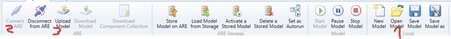
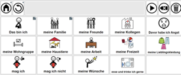

# ATLab Küchensteuerung für Gerald
Use-Case Klient Gerald/Anwendungsort Küche: Florian Brandstetter, Jan Matousek, Jessica Schauer

## Über Gerald
Er kann den rechten Arm leicht heben bzw. senken, die Handfunktion ist aber nicht vorhanden. Die große linke Zehe, Kopf, Mund/Lippen und Augen können vom Patienten verwendet werden und es sind non-verbale Funktionalitäten vorhanden.

## Verwendete Komponenten
Die Umgebungssteuerung wird mit folgenden Komponenten möglich: FABI, Asterics Runtime Environment (ARE), Asterics Configuration Suite(ACS), Asterics Grid  und OpenHAB.

Licht (FABI), Jalousien (ARE, ACS, Kitchen Webseite mit openHAB verknüpft) und eine Glühbirne (IRTrans, ACS, ARE, AsTeRICS Grid) die gesteuert werden können.

### FlipMouse
Die Flip Mouse wird mit einem Button als Eingabemöglichkeit simuliert und hat dieselbe Funktionalität wie der FABI.

### CameraMouse
Da der Patient nur den rechten Arm leicht heben und senken kann wird eine Maussteuerung mit dem Kopf als Lösungsansatz verwendet.  Dies befindet sich in der ARE und es erlaubt dem Benutzer den Laptop per Kopfbewegung anzusteuern. Ein Mausklick wird durch ein verweilen auf derselben Stelle ausgelöst, sollte ein Doppelklick, das Ziehen des Mauszeigers oder ein Rechtsklick notwendig sein kann dies im Camera Mouse Menu ausgewählt werden.

### openHAB (open Home Automation Bus)

Es erlaubt mehrere Geräte, von unterschiedlichen Anbietern miteinander zu verknüpfen mit dem Ziel der Automatisierung im Smart Home Bereich.

### FABI (Flexible Assistive Button Interface): https://www.asterics-foundation.org/projekte-2/fabi/

FABI dient als alternative Schnittstelle für Menschen mit körperlichen Beeinträchtigung und ermöglicht den Input mit Knöpfen zu lösen. An einen FABI können bis zu neun Knöpfe angeschlossen werden die mit unterschiedlichen Funktionen auf der [FABI Configuration](https://fabi.asterics.eu/index_fabi.htm) Webseite eingestellt werden, unter anderem die normalen Mausfunktionen sowie das Scanning von Reihen und Spalten, da den Knöpfen eine Bewegungssteuerung fehlt.

### ACS (AsTeRICS Configuration Suite)

Bei der ACS wird mithilfe von vorgefertigten Blöcken programmiert, diese sind in folgende Kategorien unterteilt: Sensors, Processors and Actuators.  ProACS ermöglicht das Erstellen von Modellen, die Komponenten des Computers zu Hilfsmitteln in der barrierefreien Bedienung machen und für Menschen mit körperlichen Einschränkungen nutzbar machen. Die erstellten Modelle können dann in der ARE ausgeführt werden.### ARE (AsTeRICS Runtime Environment)
Dies wird benötigt, um ACS verwenden zu können. Hier wird tatsächlich dann, was im ACS simuliert werden soll, ausgeführt.

### ARE (AsTeRICS Runtime Environment)

Dies wird benötigt, um ACS verwenden zu können. Hier wird dann das im ACS erstellte Modell ausgeführt, mit dem der Benutzer interagieren kann, ausgeführt.
AsTeRICS Grid:

Dies erlaubt Menschen, die gehörlos, stumm sind oder eine andere Sprache sprechen, bildlich zu kommunizieren. Die Anwendung ist kostenlos und es gibt viele Vorlagen im Internet auf die man zurückgreifen kann und die Möglichkeit eigene Grids zu erstellen. Es können mehrere Kategorien ausgesucht werden, also z.B. „Über mich“, „Körper“ oder „Hilfe“. Drückt man auf das Feld „Über mich“ öffnet sich ein weiteres Gitternetz:

### LED-Glühbirne

Über Asterics Grid kann der Patient die Stimmungsbeleuchtung steuern. In der ACS wurde ein fertiges IRTrans Modell ausgewählt und mit der ARE verbunden. Für die Steuerung der LED  wird dem IRTrans-Modul die Funktion der IR-Fernbedienung beigebracht und gespeichert. Das Asterics Grid ist fähig andere Asterics Framework Aktionen auszuführen und dabei ACS Modelle zu verwenden.

### IRTrans

Nachdem IRTrans heruntergeladen wurde, wurden die Anwendungen IRTransServer und GUIClient ausgeführt.

Es besteht dann die Möglichkeit der Glühbirne Befehle beizubringen oder Befehle zu senden.

Anschließend müssen der Zustand und die Farbe die man mit der Fernbedienung ausgewählt hat eingeben werden.
Dies kann in ACS folgendermaßen umgesetzt werden:

prestring: snd lightbulb,

Um dies mit AsTeRICS Grid zu verknüpfen, ist dann ein Grid anzulegen und ein neues Element und Bearbeitungsmodus soll währenddessen aktiviert sein. Um einen Befehl (zB. Rot) per AsTeRICS Grid einzugeben, ist dann dies zu machen:

### Jalousien

Sodass es im AsTeRICS Grid betätigt werden kann, müssen im ACS folgende Einstellungen durchgeführt werden.

 

 

Letztendlich ist es: <Was verändert werden soll>_<GF>_<Wo>,  <Zustand>

Dasselbe wird auch für das Licht und das Licht unter dem Tisch gemacht. Hier (StringDispatcher.1) wird verarbeitet, was aus ButtonGrid.1 kommt.

## FittsTask2D

Dieses Programm wird normalerweise verwendet, um menschliche Bewegungen durch ein Modell vorherzusagen. In einem Versuch sind 5 Kreise in einem Stern Muster angeordnet die Versuchsperson soll mit einer leichten Kopfbewegung den jeweils fett markierten Kreis anschauen (wird durch den Mauszeiger gekennzeichnet) bis alle fünf Kreise verbunden sind. Es wurde hierfür die CameraMouse verwendet. Am Ende kann man dann sehen, wie lange man gebraucht hat und wie genau der Weg zum nächsten Kreis war. Throughput sagt an, wie genau und schnell die Person beim Erwischen der Kugeln war. Je höher der Wert, desto besser. Es kommen jetzt die besten und schlechtesten Throughput Werte zu sehen.
Schlechteste throughput Wert:

Dies hat einen schlechteren Throughput, weil es nicht so einen smoothen Übergang zu den nächsten Kreisen hat. Wie in dem Bild zu sehen ist.
Beste throughput Wert:

Bei diesem Bild ist ein genauerer Übergang zwischen den Kreisen zu sehen.

## Schwierigkeiten bei der Umsetzung und Fehlersuche:

openHAB: Zeitweise gab es Ausfälle der Website die unabhängig voneinander festgestellt und reproduziert werden konnten oder Navigationsfehler z.B. zurück führt nicht zum vorherigen Menu zurück sondern springt wieder auf die Google Startseite zurück,   daher wurde im Lösungsansatz fast ausschließlich nur auf Asterics gesetzt.

Asterics(ACS, ARE, Grid): Beim Ausführen eines neuen Modells in der ARE wird nachgefragt ob das lokale Modell überschrieben werden soll, was am Anfang eine Lösung überschrieben hat.
Wenig weiterführendes Material oder nur sehr grundlegende Lösungen. Beim Versuch 2 funktionierende Modelle in ein acs File zusammenzuführen hat die resultierende Anwendung nicht funktioniert, daher werden bei der Lösung beide separate Dateien angewendet.

Zeitprobleme + Koordinierungsprobleme + Verständnisprobleme
